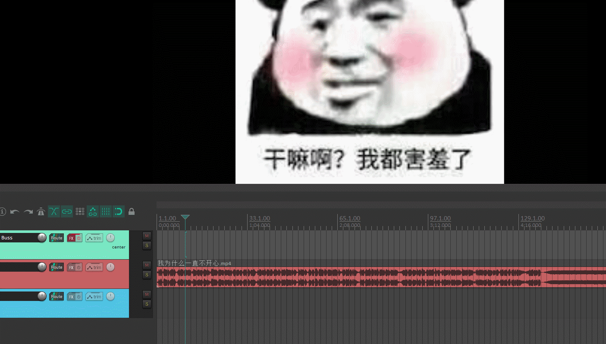

# 效果

# 说明

考虑到有的用户有根据字幕建立Region的需求，所以将操作分成独立的两步，上面的单步操作是在Reaper中通过`new custom action`来创建将两步整合起来的宏。

1. `create_region_by_srt.lua`：根据srt文件建立region
2. `create_item_by_region.lua`：根据region建立字幕item

# 注意事项
1. 该脚本并不一定能够解析所有SRT文件，网易见外工作室生成的SRT文件是可以解析的，因为我平时都用这个
2. MIDI ITEM的名字无法换行，如果追求排版的话，请保证SRT文件中的每个句子的长度不要太长

# Requirements
- `js_ReaScriptAPI`：用于打开文件选择弹窗

可以通过ReaPack直接安装，或通过[这个链接](https://github.com/juliansader/ReaExtensions/tree/master/js_ReaScriptAPI/)安装